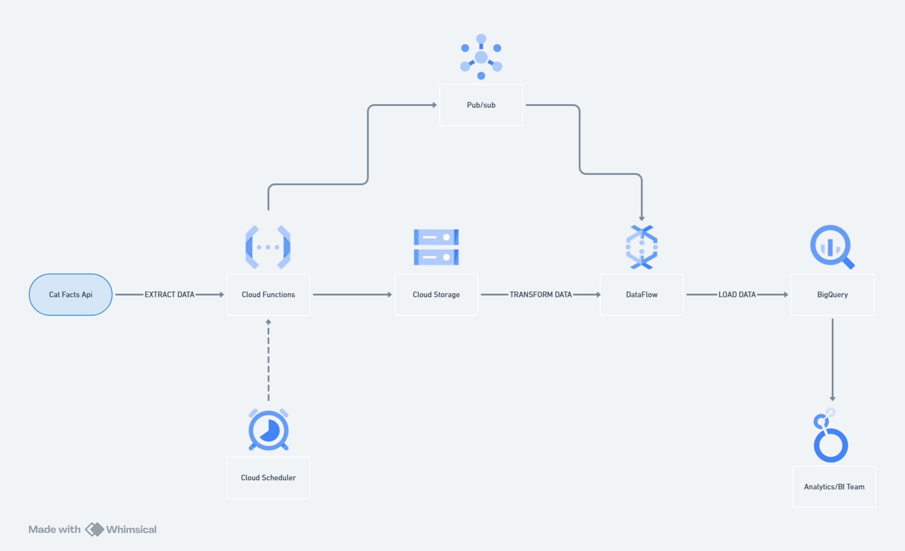

## UOLCatLovers - Desafio Técnico

Repositório com a resolução completa do desafio técnico UOLCatLovers.

A UOLCatLovers é uma startup de tecnologia pet que oferece um aplicativo móvel com fatos interessantes sobre gatos. Os dados são extraídos da API pública Cat Facts.
Documentação da API: https://alexwohlbruck.github.io/cat-facts/docs/

---

## 1. Coleta local de fatos (Python)

Como a startup foi recém-criada, ainda não há grande demanda pelos dados. Por isso, desenvolvemos um script Python simples que extrai fatos sobre gatos da API e salva em CSV local.

Arquivo: collector.py

Como usar:
- padrão: 1 fato aleatório de gato
python collector.py

- 20 fatos aleatórios de cachorro
python collector.py --species dog --number 20

- todos os fatos disponíveis (sobrescreve o arquivo)
python collector.py --all

- adiciona ao arquivo existente sem duplicar
python collector.py --all --append

---

## 2. Arquitetura na Google Cloud

Com o crescimento do aplicativo e aumento exponencial de fatos, a solução local se tornou inviável. A arquitetura na nuvem foi planejada para extrair, armazenar e disponibilizar os dados:



- Cloud Scheduler: agenda a execução diária da Cloud Function.
- Cloud Function: faz a coleta dos dados da API.
- Cloud Storage: armazena os arquivos CSV raw.
- Pub/Sub: envia notificações para pipelines de processamento.
- Dataflow: realiza ETL e transforma os dados.
- BigQuery: armazena a tabela final para análise.

---

## 3. Esquema da tabela no BigQuery

Tabela de fatos sobre gatos (cat_facts) com informações detalhadas sobre cada fato:
```
CREATE TABLE `uolcatlovers.prod.cat_facts` (
  id          STRING      NOT NULL,
  version     INT64,
  user_id     STRING,
  text        STRING,
  created_at  TIMESTAMP,
  updated_at  TIMESTAMP,
  deleted     BOOL        DEFAULT FALSE,
  source      STRING,
  animal_type STRING,
  status      STRUCT<
    verified   BOOL,
    feedback   STRING,
    sent_count INT64
  >
)
PARTITION BY DATE(updated_at)
CLUSTER BY animal_type;
```
---

## 4. Fatos atualizados em agosto de 2020

Consulta SQL para extrair fatos atualizados no mês de agosto de 2020:
```
SELECT *
FROM `uolcatlovers.prod.cat_facts`
WHERE updated_at >= '2020-08-01'
  AND updated_at < '2020-09-01';
```
---

## 5. Amostra aleatoria de 100 registros para o time QA

Consulta SQL para exportar 100 registros aleatórios contendo texto, data de criação e data de atualização, separando os dados em CSV no GCS:
```
EXPORT DATA OPTIONS(
  uri = 'gs://uolcatlovers-qa/amostra_qa_*.csv',
  format = 'CSV',
  overwrite = false,
  header = true,
  field_delimiter = ','
)
AS
SELECT 
  text,
  created_at,
  updated_at
FROM `uolcatlovers.prod.cat_facts`
ORDER BY RAND()
LIMIT 100;
```
---

- O repositório contém scripts Python e consultas SQL prontas para execução.
- A arquitetura na GCP é conceitual, mostrando a evolução do projeto da coleta local até a solução em nuvem.
- O arquivo sempre sera salvo no storage no URI especificado em cada query de criação de tabela caso rode amostra de QA duas ou mais vezes teremos 2 arquivos (exemplo: amostra_qa_000000000000.csv & amostra_qa_000000000001.csv) diferente da criação da tabela principal de prod que sempre sera sobre escrita


